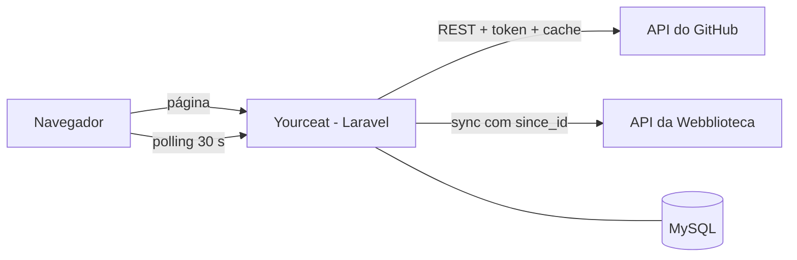

# Yourceat

**Seu programador, a um direct de distância.** Uma apresentação do meu trabalho e das soluções que posso construir para clientes: sites, catálogos, sistemas para processos e integrações. Atuo em Boa Esperança, Santa Rita do Sapucaí e região, com abertura para projetos à distância.

A página reúne meu perfil e meus projetos do GitHub com a atividade recente da [Webblioteca](https://webblioteca.laravel.cloud), um sistema de biblioteca que também é projeto meu.

O objetivo é prático: **consumir APIs de verdade** (a do GitHub e a da Webblioteca, que eu mesmo construí) e lidar com os problemas reais de quem faz isso, como limite de requisições, cache, falhas externas e privacidade.

O currículo pode ser compartilhado separadamente pela rota `/curriculo`, com um botão para voltar ao portfólio.

## O que a página mostra

- **Apresentação e serviços:** proposta de contratação, trajetória e contatos; avatar do GitHub como marca.
- **README do perfil:** sempre aberto, antes dos projetos.
- **Projetos:** repositórios públicos próprios, sem forks nem arquivados; apresentação contextual da Hidrauboa e Webblioteca, com README carregado sob demanda em cada módulo.
- **Últimos commits:** cards compactos com mensagem, repositório e data.
- **Atividade na Webblioteca:** somente as seis atividades mais recentes recebidas, consultadas a cada 30 segundos. O limite é visual; o histórico permanece no banco.

## Stack

| Camada | Tecnologia |
|---|---|
| Backend | PHP 8.4 + Laravel |
| Banco de dados | MySQL 8 |
| Servidor web | Nginx |
| Infraestrutura | Docker + Docker Compose |
| Frontend | Blade + JavaScript puro |

## Como funciona



As chamadas autenticadas às APIs são feitas no servidor, sem expor tokens ao navegador. Fontes, avatar e imagens da documentação podem ser carregados diretamente de provedores externos.

### API do GitHub

| Dado | Endpoint |
|---|---|
| Perfil | `GET /users/{user}` |
| Projetos | `GET /users/{user}/repos` |
| Commits | `GET /repos/{user}/{repo}/commits?author={user}` |
| README do perfil | `GET /repos/{user}/{user}/readme` |

Decisões técnicas:

- **Autenticação com token:** sem token o GitHub permite 60 requisições por hora; com token, 5.000. Como o token só lê dados públicos, ele não precisa de nenhuma permissão extra.
- **Cache de 5 minutos:** reduz chamadas repetidas; o consumo varia conforme os repositórios consultados e a documentação aberta pelos visitantes.
- **Cache em dois níveis:** além da cópia "fresca", guardo uma cópia de 24 horas. Em falhas do GitHub, o último dado bom pode ser usado na geração atual do cache. Uma invalidação por webhook descarta também esse fallback.
- **Monitoramento do limite:** o cabeçalho `X-RateLimit-Remaining` é lido a cada resposta e gera um aviso no log quando restam poucas requisições.
- **Commits por repositório:** busco nos repositórios mais recentes em vez de usar o endpoint de eventos, que pode ter atraso.
- **README sanitizado:** o HTML cru do Markdown é removido antes de renderizar, e protocolos inseguros são bloqueados.
- **README dos projetos sob demanda:** `GET /projetos/{repo}/readme` só aceita repositórios públicos elegíveis do proprietário configurado. Cache por proprietário/geração/repositório, fallback de 24h, ausência cacheada por 60s e lock para concorrência. Ao renovar a documentação, o fallback só é permitido se os metadados confirmarem que o repositório continua público; falha nessa verificação deixa a documentação indisponível. A home não busca todos os READMEs.
- **Documentação navegável:** links e imagens relativos dos projetos são resolvidos pelo AST do CommonMark; âncoras apontam ao GitHub. Conteúdo acima de 512 KiB oferece link para leitura integral, sem truncamento silencioso.

### API da Webblioteca

A Webblioteca expõe `GET /api/v1/activities` com autenticação por token (somente leitura), paginação e o filtro `since_id`.

- **Cópia local:** o Yourceat sincroniza só os eventos novos (usando o maior `external_id` já salvo como `since_id`) e guarda no MySQL. A página sempre lê do banco, então continua funcionando se a Webblioteca estiver fora do ar ou lenta.
- **Sem duplicados:** cada evento é gravado por `updateOrCreate` na chave `external_id`.
- **Trava de sincronização:** no máximo 1 chamada à API a cada 20 segundos, mesmo com muitos visitantes.
- **Privacidade:** a identificação do ator não é persistida; a apresentação usa "Um usuário" ou "Sistema". O resumo do evento ainda é armazenado, portanto a origem também deve evitar dados pessoais nesse conteúdo.
- **Quase tempo real:** o navegador consulta o Yourceat a cada 30 segundos (polling) e só pede o que é mais novo que o último item exibido. Não é tempo real de verdade, e isso é intencional: polling é simples, robusto e suficiente para este caso.

### Diagnóstico de autenticação da Webblioteca

`WEBBLIOTECA_TOKEN` deve ser um token Sanctum emitido no **mesmo ambiente/banco** indicado por `WEBBLIOTECA_URL`, com a permissão `activities:read`. Um token criado na instalação local não autentica automaticamente na aplicação publicada.

Se o endpoint responder 401 mesmo com a variável preenchida, confira o ambiente de emissão, validade/revogação e configuração efetivamente carregada. O health responder 200 não comprova autenticação. Para emitir um token, execute no console do ambiente da Webblioteca que será consumido:

```bash
php artisan activities:issue-token yourceat --email=EMAIL_DE_UM_USUARIO_EXISTENTE
```

Copie o resultado diretamente para a configuração privada do Yourceat; nunca para chat, logs ou Git. Se houver configuração Laravel cacheada, atualize esse cache conforme o processo do ambiente. Não desative Sanctum para contornar 401.

O sincronizador importa até 50 eventos por janela de 20 segundos e valida/grava cada lote em transação. O polling devolve os próximos 20 IDs, em ordem de exibição decrescente, sem pular eventos intermediários. Falhas ficam registradas como `Webblioteca sync failed`, apenas com etapa e status HTTP, sem corpo da resposta ou credenciais.

Testes isolados de backend, com SQLite em memória e HTTP simulado:

```bash
docker compose exec -T -e APP_ENV=testing -e DB_CONNECTION=sqlite -e DB_DATABASE=:memory: -e CACHE_STORE=array -e SESSION_DRIVER=array app php artisan test
```

## Rodando localmente

Pré-requisitos: Docker, Docker Compose e um token do GitHub (Settings → Developer settings → Personal access tokens → Fine-grained tokens, com acesso somente leitura a repositórios públicos).

```bash
git clone https://github.com/NathanLuceat/yourceat.git
cd yourceat
cp .env.example .env
# edite o .env (veja a tabela abaixo)

docker compose up -d --build
docker compose exec app composer install
docker compose exec app php artisan key:generate
docker compose exec app php artisan migrate
```

Acesse `http://localhost:8080`.

### Frontend e personalização

O portfólio usa Blade, CSS e JavaScript puro, sem build obrigatório: a view carrega diretamente `public/css/portfolio.css`, `public/js/activities.js` e `public/js/projects.js`. Os comandos do Vite não são necessários para esta página.

- Conteúdo pessoal, contatos e estrutura: `resources/views/home.blade.php`.
- Paleta, tipografia e responsividade: tokens em `public/css/portfolio.css`. O tema claro da Webblioteca fica isolado em `.library-section`.
- A lista de projetos e descrições vem de `GitHubService`. Apresentações comerciais dos cases correspondentes ficam em `resources/views/partials/project.blade.php`, separadas da documentação remota.
- O README pessoal permanece aberto. Documentação de projetos carrega ao expandir o módulo; sem JavaScript, o link para o GitHub continua disponível.
- Fraunces e Figtree são carregadas pelo Bunny Fonts; Georgia e fontes do sistema mantêm a página legível se esse serviço estiver indisponível.
- “Lista consultada” informa a consulta ao Yourceat, não confirma a disponibilidade da API externa da Webblioteca.

Teste isolado da view, sem chamar APIs nem consultar o banco:

```bash
docker compose exec -T app php artisan test --filter PortfolioViewTest
```

### Currículo independente

A página `/curriculo` pode ser compartilhada sem enviar o restante do portfólio (localmente: `http://localhost:8080/curriculo`). O conteúdo fica em `resources/views/curriculo.blade.php`, com estilos `.cv-*` no CSS do portfólio. Não depende das APIs do GitHub ou da Webblioteca e não carrega os scripts de integração.

Use a impressão do navegador para salvar em PDF; o currículo ganha fundo branco e oculta a navegação nesse modo. Os contatos públicos usam o e-mail atual, sem endereço residencial completo ou data de nascimento.

### Variáveis de ambiente

| Variável | Descrição |
|---|---|
| `DB_CONNECTION`, `DB_HOST`, `DB_PORT`, `DB_DATABASE`, `DB_USERNAME`, `DB_PASSWORD` | Conexão com o MySQL (`DB_HOST=db` no Docker) |
| `CACHE_STORE` | `database` |
| `APP_TIMEZONE` | Fuso horário, por exemplo `America/Sao_Paulo` |
| `GITHUB_USERNAME` | Usuário cujo perfil será exibido |
| `GITHUB_TOKEN` | Token pessoal do GitHub |
| `GITHUB_CACHE_TTL` | Tempo de cache em segundos (padrão `300`) |
| `GITHUB_WEBHOOK_SECRET` | Secret privado exclusivo para validar as entregas do webhook |
| `GITHUB_WEBHOOK_REPOSITORIES` | Lista autorizada de `proprietário/repositório`, separada por vírgulas; vazia não autoriza entregas |
| `WEBBLIOTECA_URL` | URL base da API da Webblioteca |
| `WEBBLIOTECA_TOKEN` | Token de leitura da API da Webblioteca |

> Nunca faça commit do `.env`. Ele já está no `.gitignore`.

## Estrutura

```
app/
├── Http/Controllers/
│   ├── HomeController.php          # monta a página
│   └── ActivitiesController.php    # JSON para o polling
├── Models/WebbliotecaActivity.php  # cópia local dos eventos
└── Services/
    ├── GitHubService.php           # cliente da API do GitHub (cache, fallback)
    └── WebbliotecaService.php      # sincronização com a API da Webblioteca
public/js/activities.js             # polling no navegador
resources/views/home.blade.php      # página
docker/nginx.conf                   # configuração do Nginx
```

## Automações e ativação em produção

### Testes no GitHub Actions

O workflow `.github/workflows/tests.yml` executa a suíte em pushes e pull requests, usando PHP 8.4, dependências do `composer.lock`, SQLite em memória e uma chave de aplicação temporária. Não usa banco, tokens ou secrets de produção e não precisa de build Node.

Após enviar o workflow, confira a aba **Actions** do repositório. A execução local dos testes não substitui a confirmação de um run aprovado no GitHub. O workflow testa o código, mas não faz deploy nem configura proteção de branch automaticamente.

### Webhooks do GitHub

O endpoint é `POST https://SEU_DOMINIO/webhooks/github`. Após publicar esta versão, configure no ambiente privado do Laravel Cloud:

- `GITHUB_WEBHOOK_SECRET`: um secret aleatório exclusivo para os webhooks, nunca o token da API. Não cole esse valor em chat, README ou Git.
- `GITHUB_WEBHOOK_REPOSITORIES`: a lista autorizada, separada por vírgulas: `NathanLuceat/hidrauboa-site,NathanLuceat/webblioteca,NathanLuceat/yourceat,NathanLuceat/NathanLuceat`.
- `GITHUB_USERNAME`: `NathanLuceat`.

Nos quatro repositórios, acesse **Settings → Webhooks → Add webhook**, informe a URL HTTPS, selecione `application/json`, mantenha a verificação SSL habilitada e informe o mesmo secret privado. Selecione os eventos **Pushes** e **Repositories**. Confira a entrega inicial `ping` e depois uma entrega real na área **Recent Deliveries**.

A autenticação usa HMAC SHA-256 do corpo bruto. A exceção CSRF é restrita ao webhook; as demais rotas não perdem essa proteção. Sem secret ou repositório autorizado, nenhuma invalidação é permitida. O corpo é limitado a 1 MiB e o endpoint possui limite de requisições.

O webhook apenas invalida o cache do proprietário autorizado, sem buscar dados na API durante a entrega. A próxima consulta carrega os dados atualizados; portanto isso não é atualização instantânea de páginas já abertas. A invalidação também descarta o fallback anterior. Uma falha do GitHub logo após o evento pode deixar o conteúdo temporariamente indisponível, em vez de reapresentar dados anteriores à mudança de visibilidade.

Após renomear um repositório, atualize a lista autorizada. Respostas já enviadas não podem ser recolhidas e eventos só têm efeito quando entregues. Entregas repetidas são seguras; acompanhe e reenvie entregas que falharam pelo painel do GitHub.

### Sincronização horária no Laravel Cloud

O comando `php artisan webblioteca:sync` reutiliza a sincronização existente. Sucesso, lote vazio e execução dispensada pelo cooldown/lock retornam código zero; falhas reais retornam código diferente de zero, com mensagem sem credenciais ou conteúdo dos eventos.

Para ativar no Cloud:

1. Confirme banco persistente, migrations existentes aplicadas e as variáveis privadas da Webblioteca.
2. Use cache compartilhado entre aplicação, scheduler e réplicas, como `CACHE_STORE=database` com a tabela de cache/locks existente. Não use `array` ou cache local por instância em produção.
3. No **App cluster** do ambiente correto, habilite **Scheduler**, salve e faça redeploy.
4. Confira `php artisan schedule:list`: a sincronização deve aparecer uma vez por hora.
5. Para uma verificação manual, execute `php artisan webblioteca:sync` no console do ambiente. Esse comando consulta a API e grava os novos eventos; não é apenas diagnóstico de leitura.
6. Acompanhe os logs e confirme uma execução horária sem visitas antes de considerar a ativação concluída.

O Cloud invoca `schedule:run` a cada minuto, mas a tarefa só fica devida a cada hora. Não adicione um segundo cron ou worker para a mesma agenda. Localmente, `docker compose exec app php artisan schedule:work` mantém o scheduler em primeiro plano até ser interrompido.

Cada execução importa até 50 eventos. Sem visitantes, isso significa até 50 eventos por hora; um backlog maior continua nas próximas execuções. A sincronização por visitas e o polling permanecem ativos, respeitando o cooldown de 20 segundos. Locks evitam sobreposição e `onOneServer` coordena réplicas via cache compartilhado.

Tarefas agendadas podem despertar um ambiente com Scale-to-Zero e gerar custo de computação. A frequência horária reduz execuções, mas não garante custo zero. Mudanças de agenda exigem novo deploy no Cloud.

Referências: [Scheduler no Laravel Cloud](https://laravel.com/cloud/docs/scheduled-tasks.md) e [validação de webhooks do GitHub](https://docs.github.com/en/webhooks/using-webhooks/validating-webhook-deliveries).

## Checklist de entrega

- [x] Testes da integração Webblioteca com `Http::fake()` e banco isolado (sem consumir cota das APIs)
- [x] Testes de READMEs do GitHub com `Http::fake()` (cache, permissões, falhas e sanitização)
- [x] Workflow GitHub Actions configurado para push e pull request
- [ ] Confirmar primeiro run aprovado na aba Actions após enviar o workflow
- [x] Apresentação comercial, README aberto, documentação de projetos e layout responsivo
- [x] Endpoint de webhook autenticado e invalidação de cache implementados e testados
- [ ] Cadastrar os webhooks nos quatro repositórios e confirmar ping/entregas reais
- [x] Comando e agenda horária de sincronização, independente de visitas
- [ ] Habilitar Scheduler no Laravel Cloud e confirmar execução sem visitas

## Higiene do repositório

O `.gitignore` exclui credenciais, dependências, caches, logs, configurações locais de editores e arquivos de instruções/sessão de agentes de IA. Esses arquivos podem permanecer no disco sem entrar nos próximos commits.

Arquivos ocultos necessários ao projeto, como `.env.example`, `.editorconfig`, `.gitattributes` e `.gitignore`, continuam versionados. Remover um arquivo do índice não apaga suas versões do histórico anterior. Se uma credencial tiver sido exposta, revogue-a e substitua-a.

Os testes usam chamadas HTTP simuladas: a aprovação da suíte não comprova disponibilidade das APIs reais. Para compartilhar o currículo externamente, use `/curriculo` no domínio publicado; `localhost` funciona apenas na própria máquina.